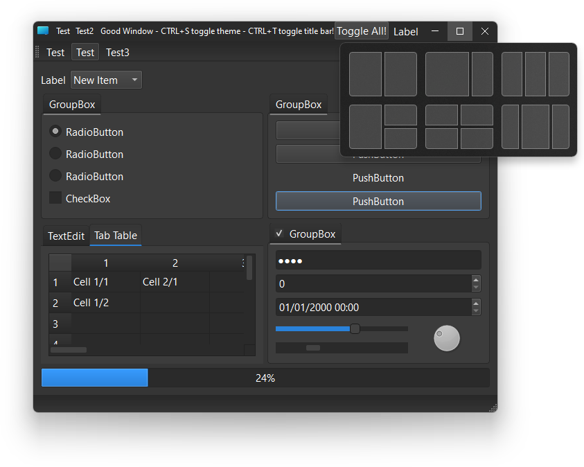

# QGoodWindow

*Border less window implementation for Qt 5 and Qt 6 on Windows, Linux and macOS.*

Version 2.3

#### *QGoodWindow* in dark mode on Windows 11: 

**QGoodWindow** gives to your application full control of the window while keeps native OS window behavior, like minimize effect.

**QGoodWindow** project is split in two modules, the  **QGoodWindow** and **QGoodCentralWidget**.

**QGoodWindow** provides the core of the project and can be used without **QGoodCentralWidget**, however **QGoodCentralWidget** offers a ready to use window with icon, title, caption buttons and a easy way to add widgets to the title bar.

### **Building, using and API:**

To see instructions on how to build, use, and `API` information, please see [the docs](docs).

### **Credits:**

- The dark theme present on GoodShowCase example and the example itself is based on this awesome work: https://github.com/Jorgen-VikingGod/Qt-Frameless-Window-DarkStyle, and the light theme was inspired on this dark theme.
- The GoodShowCaseGL example is based on the OpenGL textures example provided by [Qt](https://doc.qt.io/qt-5/qtopengl-textures-example.html).

### **Contributing:**

You can contribute with suggestions, writing issues on [Issues](https://github.com/antonypro/QGoodWindow/issues) or filling pull requests.

To see what has changed between versions, please see the [CHANGELOG](CHANGELOG.md).
