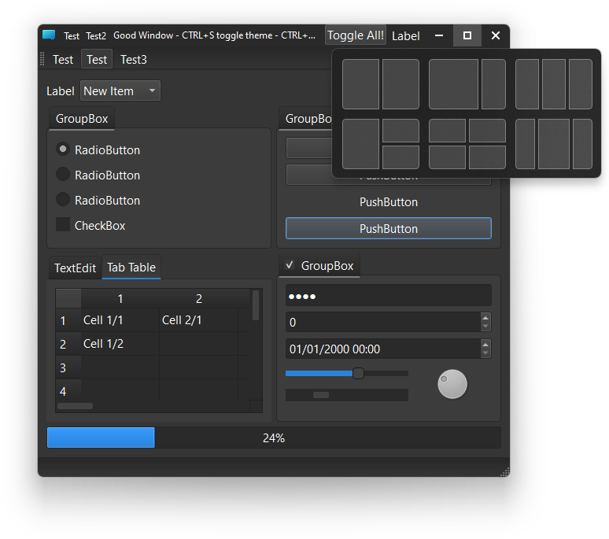
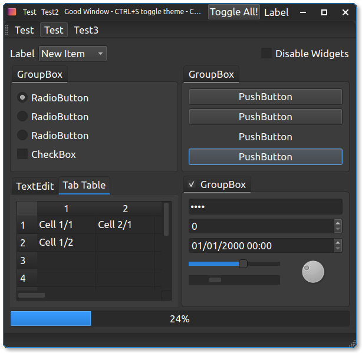
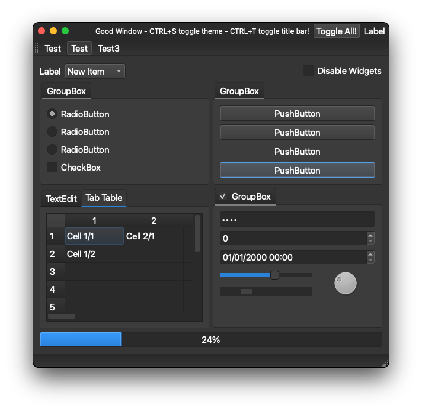

### QGoodWindow

# Edit: This project is outdated and should no longer be used.

Version 2.4.3

#### *QGoodWindow* in dark mode on Windows 11:

#### *QGoodWindow* in dark mode on Ubuntu Linux:

#### *QGoodWindow* in dark mode on macOS:

*QGoodWindow* is a library that gives to Qt developers possibilities for customization of the title bar.

*QGoodWindow* enables full title bar customization like buttons on the title bar or combine the title bar with the client area of the window.

### **Requirements:**

Is required at least **Qt 5.5** with a full compliant **C++11** compiler.

### **Building, using and API:**

To see instructions on how to build, use, and `API` information, please see [the docs](docs).

### **Credits:**

- The dark theme present on GoodShowCase example and the example itself is based on this awesome work: https://github.com/Jorgen-VikingGod/Qt-Frameless-Window-DarkStyle, and the light theme was inspired on this dark theme.
- The GoodShowCaseGL example is based on the OpenGL textures example provided by [Qt](https://doc.qt.io/qt-5/qtopengl-textures-example.html).
